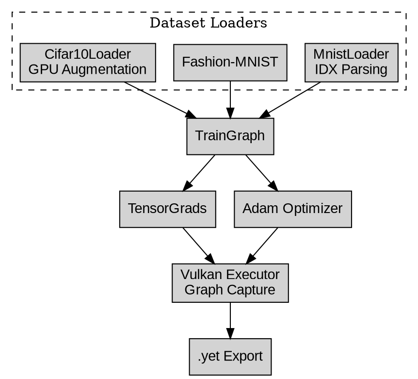

# YadraTrain – Vulkan Deep Learning Training Engine

"Train neural networks entirely on the GPU—even on Android."

[](https://isocpp.org/)
[](https://www.vulkan.org/)
[]()
[]()

A **high-performance Vulkan-native deep learning framework** written entirely in modern **C++17**.

**Yadra Core** is a training and inference engine built completely from scratch on top of **Vulkan**, using **Vulkan-Hpp** and **Vulkan Memory Allocator (VMA)**. It is capable of training neural networks **entirely on the GPU**, exporting models to its own portable **`.yet` (Yadra Executable Tensor)** format, and running the exact same codebase on **Windows, Linux, and Android**.

Unlike frameworks that rely on CUDA or external compute libraries, Yadra Core is designed around **portable Vulkan compute shaders**, allowing deep learning workloads to execute even on integrated mobile GPUs.

---

# ✨ Features

- 🚀 Pure Vulkan Compute backend
- ⚡ GPU-only forward and backward propagation
- 🧠 Automatic computation graph
- 📦 Custom `.yet` model serialization format
- 🔁 Command buffer recording + graph re-execution
- 📱 Native Android training support
- 🎯 Adam / AdamW optimizer implemented entirely on GPU
- 🎲 GPU data augmentation pipeline
- 🏗 Modern C++17 architecture
- 🌍 Cross-platform (Windows, Linux, Android)

---

# System Architecture

```text
                     ┌─────────────────────┐
                     │     Data Loaders    │
                     ├─────────────────────┤
                     │ MnistLoader         │
                     │ FashionMnistLoader  │
                     │ Cifar10Loader       │
                     └──────────┬──────────┘
                                │
                                ▼
                  ┌─────────────────────────┐
                  │      TrainGraph         │
                  │ Layers + Loss + Graph   │
                  └───────┬─────────┬───────┘
                          │         │
               ┌──────────┘         └──────────┐
               ▼                              ▼
      ┌────────────────┐             ┌─────────────────┐
      │ TensorGrads    │             │ Adam / AdamW    │
      │ GPU Gradients  │             │ GPU Optimizer   │
      └────────┬───────┘             └────────┬────────┘
               │                              │
               └──────────────┬───────────────┘
                              ▼
                   ┌────────────────────┐
                   │ Vulkan Executor    │
                   │ Compute Shaders    │
                   │ Graph Capture      │
                   └─────────┬──────────┘
                             ▼
                    Export .yet Models
```

---

# Core Components

## Dataset Loaders

### MnistLoader

Supports:

- MNIST
- Fashion-MNIST

Features:

- IDX parsing
- GPU dataset shuffling
- Efficient mini-batch generation

---

### Cifar10Loader

Features:

- Binary dataset parsing
- Channel-wise Z-score normalization
- GPU augmentation pipeline
    - Random horizontal flip
    - Random crop (+4 padding)

---

## TrainGraph

The heart of Yadra Core.

TrainGraph allows models to be assembled dynamically using reusable layers:

- Linear
- Convolution
- Batch Normalization
- Layer Normalization
- Residual blocks
- Dropout
- Pooling
- Activation functions
- Loss functions

Once defined, the graph is compiled into a reusable Vulkan execution graph.

---

## TensorGrads

TensorGrads implements all differentiable tensor operations.

Features include:

- automatic gradient propagation
- tensor arithmetic
- reductions
- gather_rows()
- GPU shuffle support

---

## Adam Optimizer

GPU implementation of:

- Adam
- AdamW (Weight Decay)

No optimizer logic runs on the CPU.

---

## Vulkan Executor

The Vulkan Executor is responsible for maximizing GPU throughput.

Instead of rebuilding command buffers every iteration, Yadra records the complete training graph **once**, then simply replays it for every batch using:

```cpp
reexecute_graph();
```

This design removes nearly all CPU overhead during training.

---

## .yet Exporter

Every trained model can be exported into a portable **Yadra Executable Tensor (.yet)** file containing:

- architecture
- weights
- biases
- metadata
- inference information

---

# Implemented Models

| Model | Dataset | Description |
|---------|----------|------------|
| **MLP** | MNIST | Fully connected classifier |
| **CNN** | Fashion-MNIST | Convolutional image classifier |
| **Autoencoder** | Fashion-MNIST | Convolutional encoder-decoder |
| **LightFastNet** | CIFAR-10 | Lightweight residual CNN |

All models share the same backend:

- TrainGraph
- TensorGrads
- VulkanExecutor
- Adam Optimizer

---

# CIFAR-10 Pipeline

The CIFAR implementation includes several training optimizations.

### GPU Data Augmentation

Performed entirely on the GPU through a dedicated Vulkan shader:

- Random crop
- Horizontal flip

The augmentation shader executes **outside** the captured graph so command buffer recording remains deterministic.

---

### Architecture

LightFastNet includes:

- Residual Blocks
- Batch Normalization
- Global Average Pooling
- Dropout

---

### Learning Rate Schedule

Training uses:

- Linear Warm-up
- Cosine Annealing

---

### Dropout

Dropout masks are regenerated every batch using:

```cpp
update_dropout_masks(batch_counter);
```

---

# Example Training Results

Entire training performed on an Android device.

| Metric | Value |
|---------|-------|
| Epochs | 23 |
| Batch Size | 128 |
| Test Accuracy | ~85% |
| Epoch Time | 40–60 seconds |

*(Results may vary depending on GPU and driver version.)*

---

# Training Pipeline

The training workflow is optimized around Vulkan command buffer reuse.

### 1. Build

The model architecture is defined using TrainGraph.

```text
Layers
 ↓
Loss
 ↓
Optimizer
 ↓
Compile
```

---

### 2. Graph Capture

A dummy forward/backward pass is executed once.

The following operations are recorded into a Vulkan command buffer:

- forward
- backward
- optimizer step

---

### 3. Training

For every batch:

```cpp
upload_input();

reexecute_graph();
```

For CIFAR-10, GPU augmentation is executed immediately before uploading the batch.

---

### 4. Export

Finally,

```cpp
graph.save();
```

produces a portable `.yet` model.

---

# Android Support

One of Yadra Core's main goals is **mobile-native deep learning**.

All currently implemented models have been successfully trained on Android using the exact same engine.

The project is built using:

- Android NDK
- Vulkan
- SPIR-V compute shaders

No CUDA, OpenCL, or vendor-specific SDKs are required.

---

# Dependencies

- Vulkan SDK 1.3+
- Vulkan-Hpp
- Vulkan Memory Allocator (VMA)
- C++17 compiler
    - MSVC
    - GCC
    - Clang
- STB (optional image export)

---

# Build

```bash
git clone https://github.com/your_username/yadra-core.git

cd yadra-core

mkdir build
cd build

cmake .. -DCMAKE_BUILD_TYPE=Release

make -j$(nproc)
```

---

# Training Examples

## MNIST

```bash
./test_mnist_train
```

## Fashion-MNIST CNN

```bash
./test_fashion_mnist_train
```

## Fashion-MNIST Autoencoder

```bash
./test_autoencoder_train
```

## CIFAR-10

```bash
./test_cifar10_train
```

Datasets should be placed inside:

```
data/
```

Expected formats:

- IDX (MNIST)
- IDX (Fashion-MNIST)
- Binary `.bin` files (CIFAR-10)

---

# The `.yet` File Format

A `.yet` file contains:

- Model metadata
- Serialized architecture
- Binary weights
- Binary biases
- Vulkan inference metadata

Designed for fast loading and deployment.

---

# Roadmap

- [ ] ImageNet support
- [ ] Transformer training
- [ ] Mixed Precision (FP16)
- [ ] SGD + Momentum
- [ ] RMSProp
- [ ] ONNX export
- [ ] Quantization
- [ ] Structured pruning
- [ ] Multi-GPU support
- [ ] Distributed training

---

# Unified Graphviz Architecture



---

# Philosophy

Yadra Core is built around a simple idea:

> **Deep learning should not depend on CUDA.**

By leveraging Vulkan Compute, the engine enables training and inference on desktops, laptops, and mobile devices using a single portable backend.

The long-term goal is to evolve Yadra into a complete Vulkan-native deep learning framework capable of training modern architectures—from CNNs to Transformers—entirely on the GPU.

---

## License

MIT License
